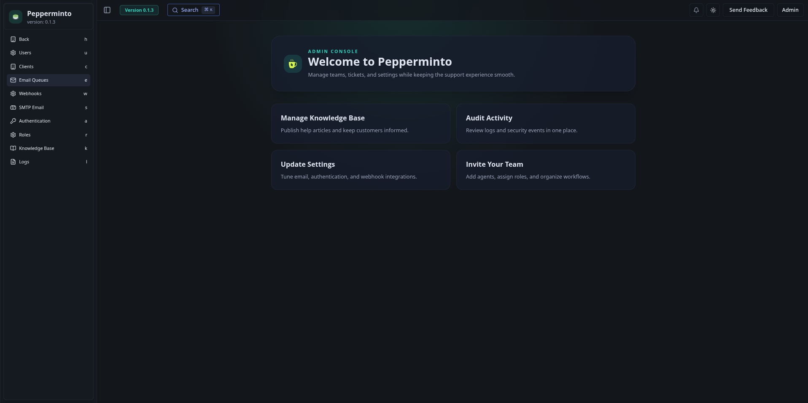

# Pepperminto 🍵

Pepperminto is a modern, community-driven ticket management system and knowledge base. It is a modernized fork of [Peppermint](https://peppermint.sh), rebuilt as a high-performance monorepo with a focus on developer experience and a premium user interface.

<p align="center">
  
  
</p>

---

## 🏗️ Lineage & Credits

Pepperminto is built upon the foundation of incredible open-source projects. We owe a great debt of gratitude to the original creators:

- **Peppermint.sh**: The original inspiration and codebase. Find them at [peppermint.sh](https://peppermint.sh) or their [GitHub](https://github.com/Peppermint-Lab/peppermint).
- **nulldoubt/pepperminto**: A key iteration of the fork that paved the way for this repository. [Original Repo](https://github.com/nulldoubt/pepperminto).

---

## ✨ Key Features & Improvements

Pepperminto evolves the original concept with modern tooling and enhanced functionality:

### 🎨 Modernized Admin Experience

- **Rebuilt with shadcn/ui**: A completely overhauled interface using modern design patterns.
- **Dark Mode Support**: Native dark mode across the entire dashboard and knowledge base.
- **Responsive Design**: Fully usable across desktop, tablet, and mobile devices.

### 📚 Public Knowledge Base

- **SEO Optimized**: A dedicated public-facing site for your articles and documentation.
- **Admin CRUD Workflows**: Create, edit, and organize knowledge base articles directly from the dashboard.
- **Custom Slugs**: User-friendly URLs for better discoverability and SEO.

### 📝 Precision Editing
- **BlockNote Integration**: A rich-text editing experience that feels like Notion.
- **Consistency**: The same powerful editor is used across tickets, internal documents, and the knowledge base.

### 🛠️ Core Capabilities
- **Ticket Management**: Full lifecycle management for support requests.
- **IMAP Integration**: Automatically fetch and process emails as tickets.
- **Time Tracking**: Log and manage time spent on various tasks.
- **Webhooks & Storage**: Extensible architecture with webhook support and flexible object storage.
- **Role-Based Access**: Granular control over user permissions and roles.

### ⚙️ Developer-First Architecture
- **Turborepo + pnpm**: Lightning-fast builds and efficient workspace management.
- **Clean Monorepo**: Separated concerns with `apps/api`, `apps/client`, and `apps/knowledge-base`.
- **Fastify Backend**: A high-performance, schema-driven API with automated Swagger documentation.

---

## 📦 Monorepo Layout

- `apps/api` – Fastify API server with Prisma ORM.
- `apps/client` – Admin dashboard and ticket management (Next.js).
- `apps/knowledge-base` – SEO-friendly public documentation site (Next.js).

---

## 🚀 Quick Start

### Local Development

1. **Install Dependencies**:
   ```bash
   pnpm install
   ```

2. **Setup Environment**:
   Copy `.env.example` to `.env` and configure your database and API settings.

3. **Start Development**:
   ```bash
   pnpm dev
   ```

### Default Credentials
On a fresh installation, you can log in with:
- **Email**: `admin@admin.com`
- **Password**: `1234`
> [!IMPORTANT]
> Change these credentials immediately after your first login.

---

## 🐳 Docker Deployment

The simplest way to run Pepperminto is via Docker Compose:

```bash
cp .env.example .env
docker compose build
docker compose up -d
```

---

## 🔗 Project Links

- **Main Repository**: [DelilahSaturn/pepperminto-enhanced](https://github.com/DelilahSaturn/pepperminto-enhanced)
- **Original Project**: [Peppermint.sh](https://peppermint.sh)
- **Ancestor Fork**: [nulldoubt/pepperminto](https://github.com/nulldoubt/pepperminto)

## ⚖️ License

Pepperminto is licensed under the GNU Affero General Public License (AGPLv3). See the `LICENSE` file for details.

